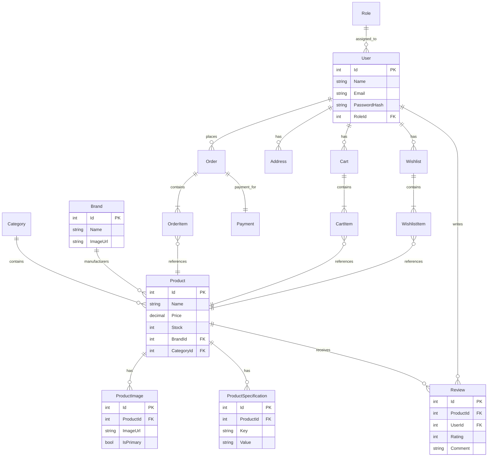

# Entity Relationship Diagram (Updated)

```mermaid
erDiagram
    User ||--o{ Order : places
    User ||--o{ Address : has
    User ||--o{ Cart : has
    User ||--o{ Wishlist : has
    User ||--o{ Review : writes
    Role ||--o{ User : assigned_to
    
    Category ||--o{ Product : contains
    Brand ||--o{ Product : manufacturers
    
    Cart ||--|{ CartItem : contains
    CartItem }o--|| Product : references
    
    Wishlist ||--|{ WishlistItem : contains
    WishlistItem }o--|| Product : references
    
    Order ||--|{ OrderItem : contains
    Order ||--|| Payment : payment_for
    OrderItem }o--|| Product : references
    
    Product ||--o{ ProductImage : has
    Product ||--o{ ProductSpecification : has
    Product ||--o{ Review : receives

    User {
        int Id PK
        string Name
        string Email
        string PasswordHash
        int RoleId FK
    }

    Product {
        int Id PK
        string Name
        decimal Price
        int Stock
        int BrandId FK
        int CategoryId FK
    }

    Brand {
        int Id PK
        string Name
        string ImageUrl
    }
    
    ProductImage {
        int Id PK
        int ProductId FK
        string ImageUrl
        bool IsPrimary
    }

    ProductSpecification {
        int Id PK
        int ProductId FK
        string Key
        string Value
    }

    Review {
        int Id PK
        int ProductId FK
        int UserId FK
        int Rating
        string Comment
    }
```
